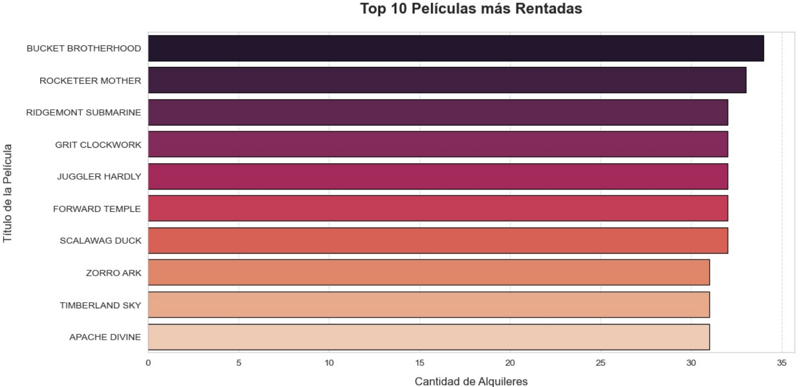
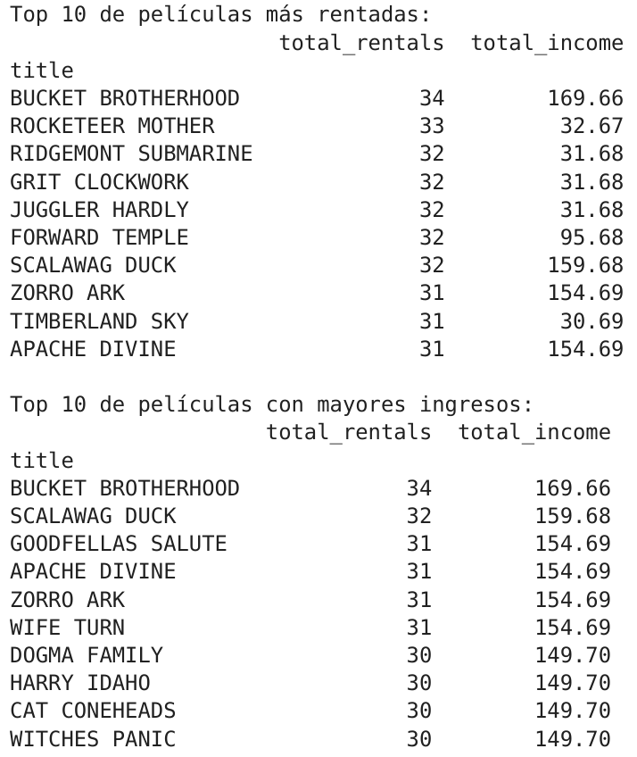
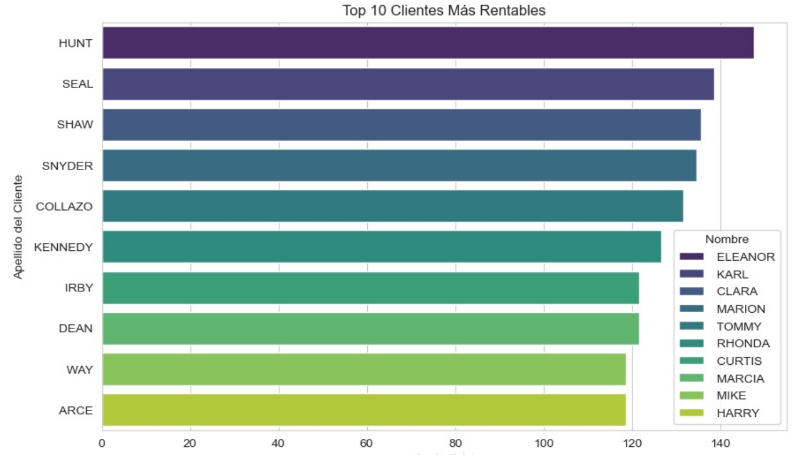
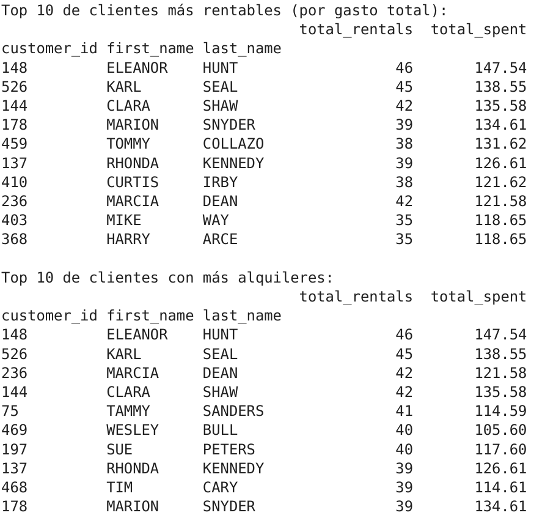
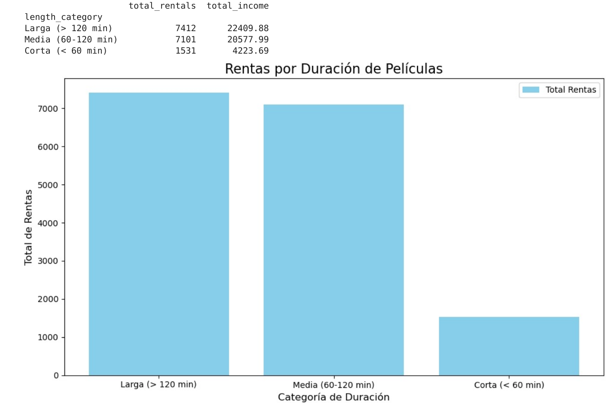
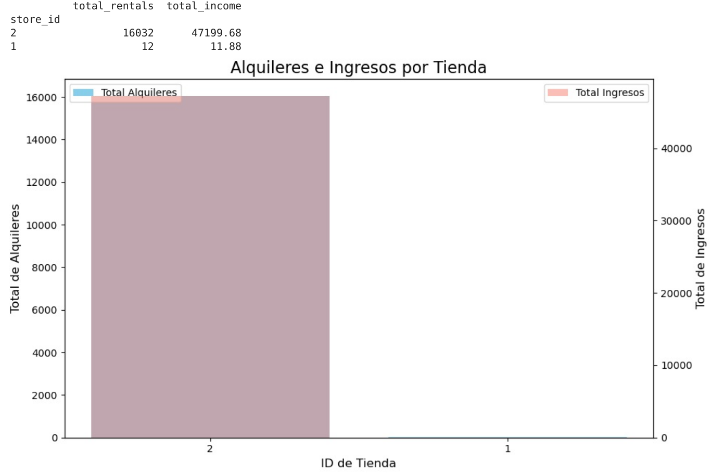
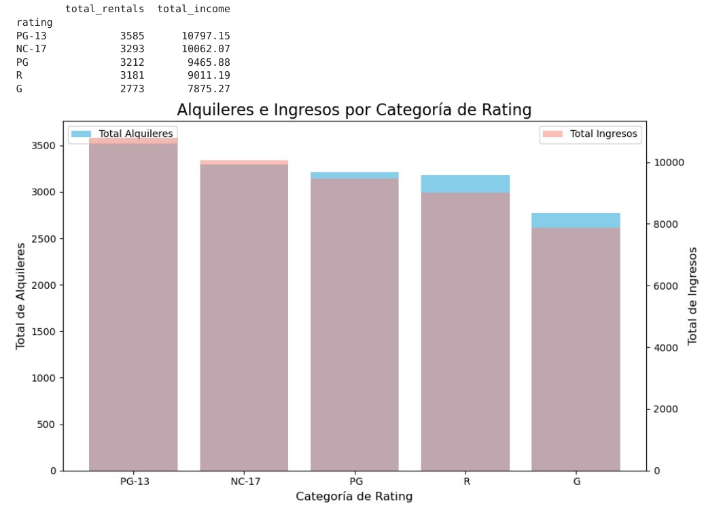

# Informe de Presentación de Resultados

## Arquitectura de Datos

### Entidades Principales

- **Customer**: Almacena información sobre los clientes, incluyendo su nombre, correo electrónico y dirección.
- **Store**: Contiene datos sobre las tiendas, como el ID del gerente y la dirección.
- **Rental**: Registra los alquileres de películas, incluyendo fechas de alquiler y devolución, el cliente asociado y el personal que atendió el alquiler.
- **Film**: Almacena detalles sobre las películas, como el título, descripción, año de lanzamiento y costo de reemplazo.
- **Inventory**: Gestiona el inventario de películas disponibles en las tiendas.

### Relaciones

- Un **Customer** puede realizar múltiples **Rentals**.
- Un **Store** puede tener múltiples **Rentals** asociados.
- Un **Film** puede estar involucrado en múltiples **Rentals**.
- Un **Inventory** está asociado a un **Film** y a un **Store**, indicando qué películas están disponibles en qué tiendas.

---

## Arquetipo de la Aplicación

### Estructura del Proyecto

- **Data_Analysis**: Contiene un PDF exportado de un archivo `.ipynb`.
  - **analisis_exploratorio_preguntas_respuestas.pdf**: Incluye el análisis exploratorio de los datos y las preguntas relacionadas.
- **Informe**: Contiene todo lo relacionado con el informe.
  - **imagenes**: Almacena las imágenes utilizadas en `informe.md`.
  - **Informe.md**: Ubicación donde se encuentra este documento.
- **src**: Contiene el código fuente de la aplicación.
  - **data**: Almacena los datos generados por la aplicación.
  - **logs**: Guarda los registros de la aplicación.
  - **methods**: Contiene los métodos principales para la manipulación de datos.
    - **extract.py**: Para la extracción de datos.
    - **load.py**: Para la carga de datos.
    - **transform.py**: Para la transformación de datos.
  - **utils**: Utilidades adicionales.
    - **logger.py**: Para el registro de eventos.
    - **metric.py**: Para métricas de la aplicación.
    - **config.py**: Configuraciones de la aplicación.
  - **main.py**: Script principal de la aplicación.
- **Films_2.xlsx**: Archivo utilizado en la elaboración de los datos de la aplicación.
- **Informe.md**: Documentación del informe.
- **README.md**: Documentación general del proyecto.
- **requirements.txt**: Dependencias del proyecto.

### Flujo de Datos

1. Los datos se extraen del archivo `Films_2.xlsx`.
2. Las hojas del documento Excel se extraen y se guardan en formato `.csv` para luego ser limpiadas y posteriormente almacenadas en formato `.parquet`.
3. Los datos transformados se utilizan para generar el análisis de datos.

---

# Análisis exploratorio de datos

## Introducción
En este informe, se presenta un análisis de los datos relacionados con alquileres de películas, clientes, tiendas y películas. El objetivo principal es explorar las relaciones entre estas entidades, identificar insights clave y responder a preguntas específicas relacionadas con el negocio.

## Objetivos del Análisis

1. **Explorar la distribución de los datos**: Comprender cómo se distribuyen las variables clave, como el número de alquileres, clientes y películas.
2. **Identificar relaciones entre variables**: Analizar las correlaciones entre diferentes entidades, como clientes y alquileres, o películas y tiendas.
3. **Detectar valores atípicos y datos faltantes**: Identificar posibles anomalías en los datos que puedan afectar el análisis.
4. **Responder preguntas específicas**: Utilizar los datos para responder las siguientes preguntas clave del negocio:
   - ¿Cuáles son las películas más rentadas y cuáles generan mayores ingresos?
   - ¿Cuáles son los clientes más rentables?
   - ¿Las películas más largas se rentan más o generan más ingresos que las más cortas?
   - ¿Cuál es el rendimiento de cada tienda en términos de ingresos y alquileres?
   - ¿Qué categorías de películas han dado mayor ingreso?

## Datos Utilizados

El análisis se basa en los siguientes conjuntos de datos principales:

- **Customer**: Información sobre los clientes, incluyendo nombre, correo electrónico y dirección.
- **Store**: Datos sobre las tiendas, como el ID del gerente y la dirección.
- **Rental**: Registros de alquileres de películas, incluyendo fechas de alquiler y devolución, cliente asociado y personal que atendió el alquiler.
- **Film**: Detalles sobre las películas, como título, descripción, año de lanzamiento y costo de reemplazo.
- **Inventory**: Inventario de películas disponibles en las tiendas.

## Metodología

El análisis se llevó a cabo utilizando las siguientes técnicas y herramientas:

- **Visualización de datos**: Gráficos y tablas para explorar la distribución y relaciones entre variables.
- **Estadísticas descriptivas**: Medidas como media, mediana, desviación estándar y percentiles para resumir los datos.
- **Limpieza de datos**: Identificación y manejo de valores faltantes, duplicados y atípicos.
- **Análisis de correlaciones**: Uso de gráficos de dispersión, histogramas, etc., para identificar relaciones entre variables.

---

## Resultados del Análisis Exploratorio

### 1. ¿Cuáles son las películas más rentadas y cuáles generan mayores ingresos?

<figure>
    
    <figcaption>Figura 1: Top 10 de películas más rentadas.</figcaption>
</figure>

<figure>
    
    <figcaption>Figura 2: Información detallada de las películas más rentadas.</figcaption>
</figure>

* **RESPUESTA**: En la gráfica se presentan el top 10 de películas más rentadas. La película que genera más ingresos es **BUCKET BROTHERHOOD**.

---

### 2. ¿Cuáles son los clientes más rentables?

<figure>
    
    <figcaption>Figura 3: Top 10 de clientes más rentables.</figcaption>
</figure>

<figure>
    
    <figcaption>Figura 4: Información detallada de los clientes más rentables.</figcaption>
</figure>

* **RESPUESTA**: En la gráfica se presentan el top 10 de clientes más rentables, siendo **Eleanor Hunt** el cliente más rentable de todos.

---

### 3. ¿Las películas más largas se rentan más o generan más ingresos que las más cortas?

<figure>
    
    <figcaption>Figura 5: Relación entre la duración de las películas y su rentabilidad.</figcaption>
</figure>

* **RESPUESTA**: Las películas de mayor duración (más de 2 horas) generan más ingresos que las de menor duración (menos de 1 hora).

---

### 4. ¿Cuál es el rendimiento de cada tienda en términos de ingresos y alquileres?

<figure>
    
    <figcaption>Figura 6: Comparación del rendimiento de cada tienda en ingresos y alquileres.</figcaption>
</figure>

* **RESPUESTA**: El rendimiento de la **tienda 2** es totalmente superior al de la **tienda 1**.

---

### 5. ¿Qué categorías de películas han dado mayor ingreso?

<figure>
    
    <figcaption>Figura 7: Análisis de las categorías de películas con mayores ingresos.</figcaption>
</figure>

* **RESPUESTA**: Las películas con categoría **PG-13** han dado mayor ingreso.

---

## Conclusiones Preliminares

El análisis exploratorio ha permitido identificar varios insights clave, como las películas más populares, los clientes más activos y las diferencias entre tiendas. Estos hallazgos serán útiles para guiar decisiones estratégicas y optimizar el negocio. Además, más gráficas y otras relaciones se encuentran en el archivo **"analisis_exploratorio_preguntas_respuestas.pdf"**.

---